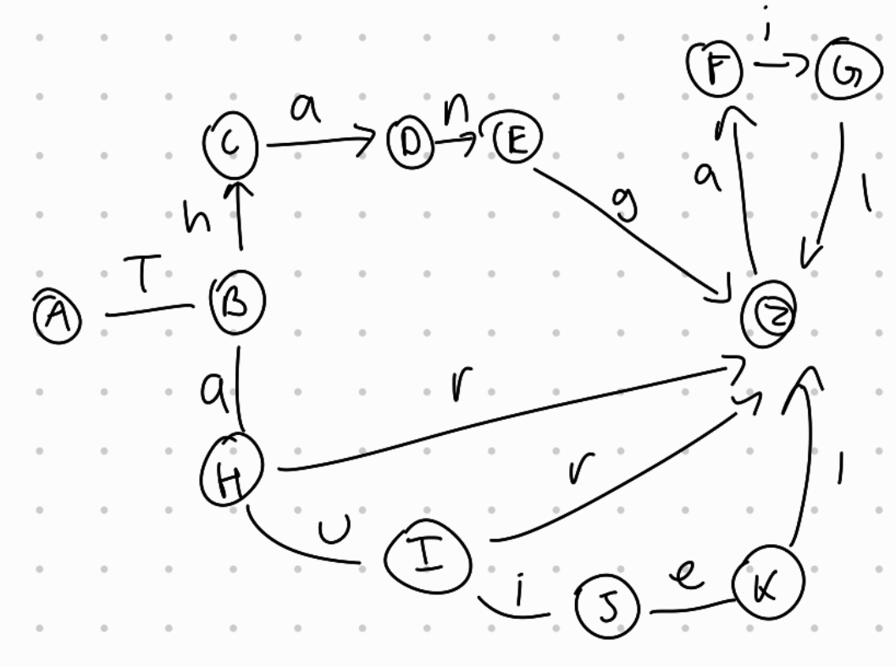
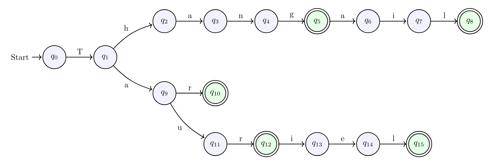

# Evidence 1: Implementation of Lexical Analysis

**Author:** Lucca Traslosheros Abascal (A01713944)  
**Course:** TC2037 Implementation of Computational Methods  

---
## Description

This repository contains the evidence for the implementation of a lexical analyzer using both an Automaton (DFA) and a Regular Expression. 

The language chosen for this lexical analysis is based on Tolkien's Elvish vocabulary (specifically Sindarin) as described in (Gateway, 2026). J. R. R. Tolkien creeated this language for his Middle-Earth fiction and based oThe accepted lexicon consists of the following terms:

1. **Thang** - Oppression
2. **Thangail** - Sindarin for a sort of shield-fence.
3. **Tar** - High
4. **Taur** - Forest
5. **Tauriel** - Daughter-of-the-Forest

To systematically recognize patterns within this language, I chose to model it using a Deterministic Finite Automaton (DFA). While a Nondeterministic Finite Automaton (NFA) allows for null inputs and multiple state transitions for a single character, it inherently introduces ambiguity and often requires translation into a DFA for programmatic implementation (GeeksforGeeks, 2020).   

Because our target language is a strictly defined, finite set of five words without a need for backtracking, a DFA is the most model. In a DFA, every input character corresponds to exactly one state transition

## Models of the Solution

During the design phase, I developed two different iterations of the Deterministic Finite Automaton to analyze the structural requirements of the language. 

**$\Sigma = \{T, a, e, g, h, i, l, n, o, r, u\}$**

Any inputted character that is not in this alphabet will not be accepted and will reject the word. 



The first was the initial design to geet all the valid words into a single accepting state. 
While a single accepting state seems simpler on the surface, this model is fundamentally flawed for this specific language. By sharing the accepting state Z, the automaton conflates the paths of different words. 

For example, both "Thang" and "Taur" reach state Z. Because the transitions for the suffixes "ail" (from Thangail) and "iel" (from Tauriel) both stem from Z, the automaton would incorrectly accept  words like "Thangiel" or "Tarail". To keep the language strictly limited to the 5 chosen words, the paths must remain isolated.



To resolve the state conflation issue, I designed the final model with multiple accepting states ($q_5, q_8, q_{10}, q_{12}, q_{15}$).

### 2. Regular Expression

The automaton modeled above can be simplified into a single, mathematically equivalent Regular Expression. According to Computer Hope, Regex is "Short for regular expression, a regex is a string of text that lets you create patterns that help match, locate, and manage text" (Hope, 2024).

### ^T(hang(ail)? | a(r | ur(iel)?))
    
## Implementation

I used the automaton to create a Knowledge Base in Prolog to implement my lexical analysis. The knowledge base explicitly defines the current state, the next state, and the symbol that moves the automaton from one state to the other. This is modeled in the following way:

```
move(current_state, next_state, symbol).
```

There is also an additional rule to define the accepted states. Because my automaton has multiple accepting states (one for each valid word termination), there are several instances of this rule:

```
accepting_state(q5).
accepting_state(q8).
```
% ... and so on for q10, q12, and q15

```
parseDFA(InputString) :-
```

As well as the base case rule, which evaluates to true and prints "Accepted" if the list is empty and the automaton has landed on a valid 
accepting state:

```
parseDFAHelper([], CurrentState) :-
```

And the recursive rule, which processes the word character by character, moving through the states defined in the knowledge base:

```
parseDFAHelper([Symbol|Rest], CurrentState) :-
```

All of these rules and the knowledge base are found in the file `elvish.pl.` If the word belongs to the defined language, the program prints "Accepted"; otherwise, if a transition fails or it ends on a non-accepting state, it prints "Rejected".

Note for execution: When running the program in the Prolog terminal, it is important to wrap the input words in single quotes (e.g., parseDFA('Tauriel').) so that Prolog correctly interprets the input as an atom before converting it to a character list.


## Tests

To thoroughly verify the integrity of the lexical analyzer, a separate test suite was created in the `test_elvish.pl` file. This script automatically runs through both valid paths and intentional edge cases to ensure the automaton correctly accepts valid Elvish terms and rejects invalid strings, incomplete words, and mixed suffixes.

### How to Run the Tests
1. Open your Prolog terminal (e.g., SWI-Prolog).
2. Load the test file by running: `['test_elvish.pl'].` (Ensure you are in the correct directory, or provide the full path).
3. Execute the test suite by running the command: `test_dfa.`

### Test Cases & Results
The following are tested in the `test_elvish.pl` and the expected outputs that have been validated.  
### Successful tests 
Below are several tests which should return valid (Accepted), since they are the words that were defined in the automaton and the language:
1. `try('Thang').`
2. `try('Thangail').`
3. `try('Tar').`
4. `try('Taur').`
5. `try('Tauriel').`

### Unsuccessful tests
Below are other words which are very similar to the words in the language, but which are not in the language. If the words are run, Prolog will return invalid (Rejected):
1. `try('Thangiel').`
2. `try('Tarail').`
3. `try('Tau').`
4. `try('Tha').`
5. `try('Sauron').`

## Analysis

### Time and Space Complexity
**Time Complexity:** The time complexity for the Prolog DFA implementation is **$O(n)$**, where $n$ is the number of characters in the input string. The program uses recursion to iterate through the list of characters, checking facts to move from one state to the next. Because the automaton is deterministic (no backtracking required) and there are no nested loops, each character is evaluated exactly once, resulting in linear time complexity.

**Space Complexity:** The auxiliary space complexity of the DFA logic itself is **$O(1)$**. The number of states is static and doesn't grow with the input size. 

### Benchmark: Automaton vs. Regular Expression
To satisfy the requirement of evaluating at least two computational models, we can compare our DFA automaton approach against the mathematical Regular Expression approach: `^T(hang(ail)? | a(r | ur(iel)?))$`

* **Execution Time :** Both the DFA state machine and a standard Regex engine process strings in linear **$O(n)$** time. However, in practice, running a Regex through an engine (like Python's `re` module) incurs an initial performance overhead to compile the expression into an internal NFA/DFA in C (Ronacher, 2015). For a strictly defined, small vocabulary like our 5-word Elvish lexicon, a direct DFA implementation (like our Prolog script) executes faster on a micro-level because it bypasses this compilation step entirely.

* **Maintainability & Scaling:** While the Prolog DFA is incredibly efficient, writing out discrete transition rules becomes tedious with dozens of words. In contrast, Regular Expressions are much easier to write, maintain, and use.

### Different Programming Languages
As seen in other solutions, this DFA could easily be implemented in imperative languages like Python, C++, or JavaScript using a `for` loop and a hash map (dictionary) for the transition table. While those implementations also achieve $O(n)$ time complexity, Prolog offers a remarkably elegant alternative. By utilizing the logic programming paradigm and a stateless knowledge base, Prolog avoids the need for object instantiation, state-tracking variables, and complex nested conditionals. The code simply declares what is true, making it a direct, 1-to-1 reflection of the mathematical DFA model.

## References

  Gateway, T. (2026, January 25). Sindarin. Tolkien Gateway. https://tolkiengateway.net/wiki/Sindarin

  GeeksforGeeks. (2020, May 16). Difference between DFA and NFA. GeeksforGeeks. https://www.geeksforgeeks.org/theory-of-computation/difference-between-dfa-and-nfa/

  Hope, C. (2024, August 16). What is a regex (regular expression)? Computer Hope. https://www.computerhope.com/jargon/r/regex.htm

  Ronacher, A. (2015, November 18). Python’s hidden regular expression gems. Armin Ronacher. https://lucumr.pocoo.org/2015/11/18/pythons-hidden-re-gems/

  Strack, P. (2026, January 1). An Elvish Lexicon. Eldamo. https://eldamo.org/
